##   Dynatrace python opentelemetry setup


### Setup & Running a Python Application to Send Open Telemetry Data to Dynatrace

1. Please see the [Instrument Python applications with OpenTelemetry](https://www.dynatrace.com/support/help/extend-dynatrace/opentelemetry/opentelemetry-ingest/opent-python) link for prerequisites

1. The [python_flask_example](https://raw.githubusercontent.com/kyledharrington/dt-opentel-helloworld/main/python/python_flask_example.py) in this repository will be used in this example

1. Please be sure to install the following pip dependencies in your environment 

    > please note, not all of these dependencies are needed for Dynatrace instrumentation, but are required for the [Open Telemetry Example Quick Start](https://opentelemetry-python.readthedocs.io/en/latest/getting-started.html#instrumentation-example-with-flask)

1. Run the following to install the needed dependencies in your local environment:
    ```
    pip install opentelemetry-api
    pip install opentelemetry-sdk
    pip install opentelemetry-instrumentation-requests
    pip install opentelemetry-instrumentation-flask
    pip install opentelemetry-instrumentation-requests
    pip install opentelemetry-exporter-otlp
    pip install opentelemetry-exporter-otlp-proto-http
    ``` 

1. Once all dependencies are installed you will need to append the python_flask_example.py file with your dynatrace ID & api tokens at lines 40 & 43, respectively:

    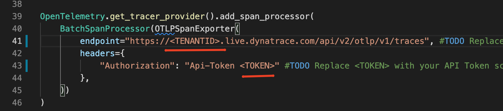

    > [Please see the Send data to Dynatrace section for token scopes needed](https://www.dynatrace.com/support/help/shortlink/opent-python)


1. You can then run the flask app:

    ```
    python python_flask_example.py
    ```

1. The flask application will now serve traffic on port 5000
1. Send traffic via web browser or GET request to:
    ```
    http://localhost:5000/
    ```
1. This will generate the "Hello" response in your browser and spans via opentelemetry and send this data to Dynatrace

    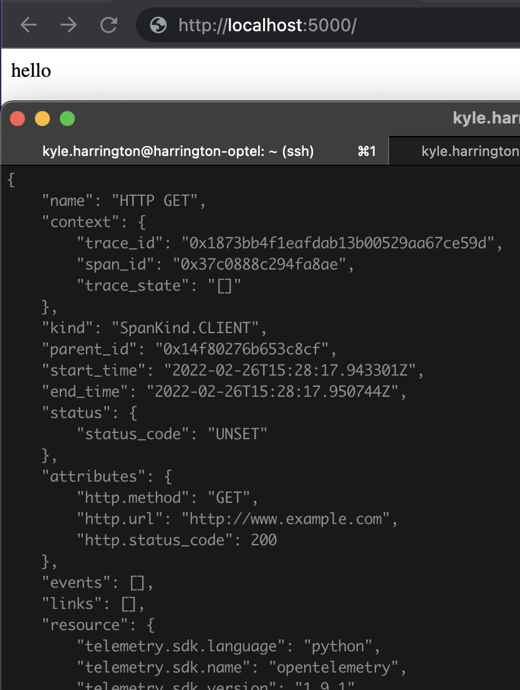


### Reviewing Open Telemetry captured by Dynatrace

1. Your newly generated opentelemetry traces will now be viewable in your Dynatrace tenant. Navigate to:

    _Applications & Microservices --> Distributed Traces --> Ingested Traces_ 

    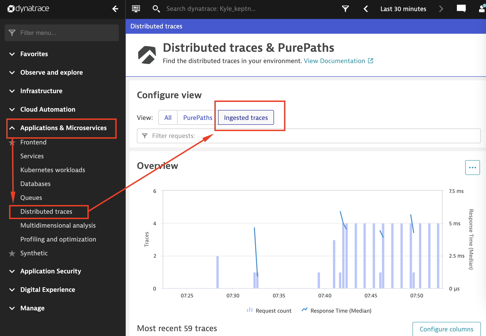

1. Each request is captured with its opentelemetry trace ids, spans and timing metrics.

    > NOTE:  The Attributes section indicates "Values note stored". Unless explicitly set, Dynatrace does not store this data. We will configure some of these fields in a later step.
    
 
    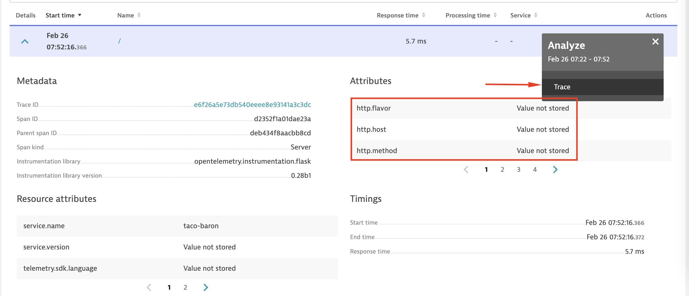

1.  Further information can be reviewed by  selecting "traces" from the top right of the ingested trace, providing the classic Dynatrace Purepath view for Open Telemetry traces

    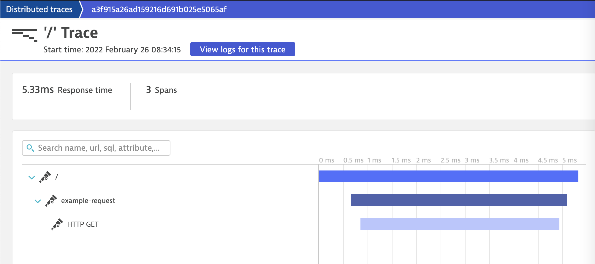

### Storing OpenTelemetry Span and Resource Attributes in Dynatrace

 > While Dynatrace automatically captures all OpenTracing and OpenTelemetry resource attributes, to prevent the accidental storage of personal data, only the values of resource attributes for which a related key is specified in the allow-list below are stored. This enables you to meet your privacy requirements while controlling the amount of monitoring data that's stored.


1. Clicking into the "/" request we can see the all the potential attributes Dynatrace is capturing, but not storing:

    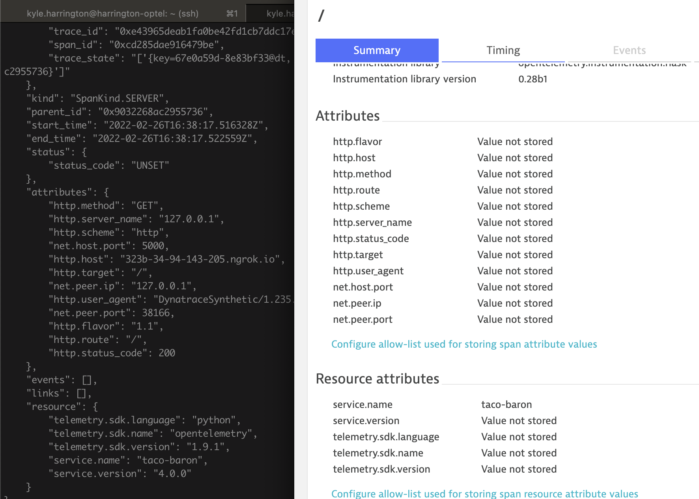

1. From here you can click on the "Configure allow-list used for storing span attribute values" or "Configure allow-list used for storing span resource attribute values" respectively 

    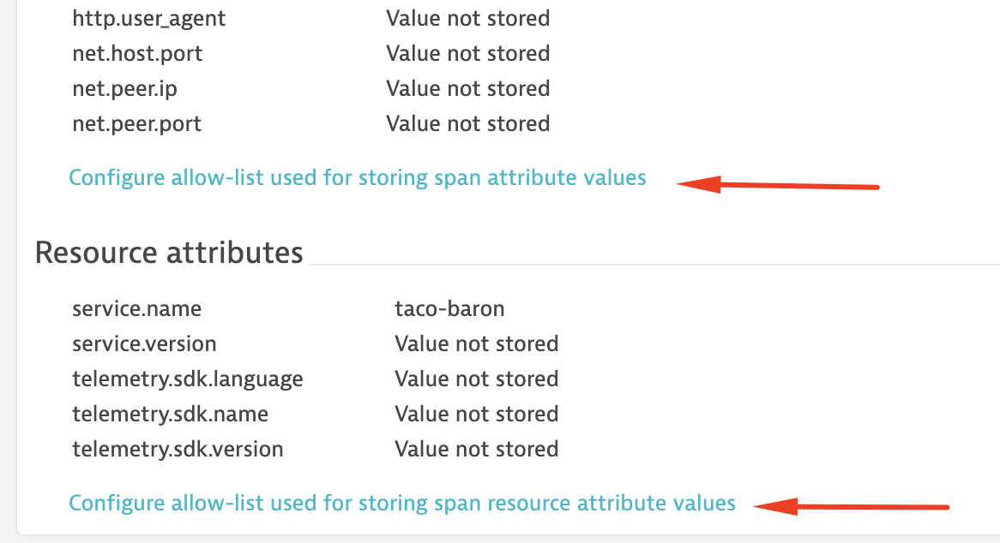

1. Or you can navigate to    _Settings --> Server-side service monitoring --> OpenTelemetry & OpenTracing Spans_ 

    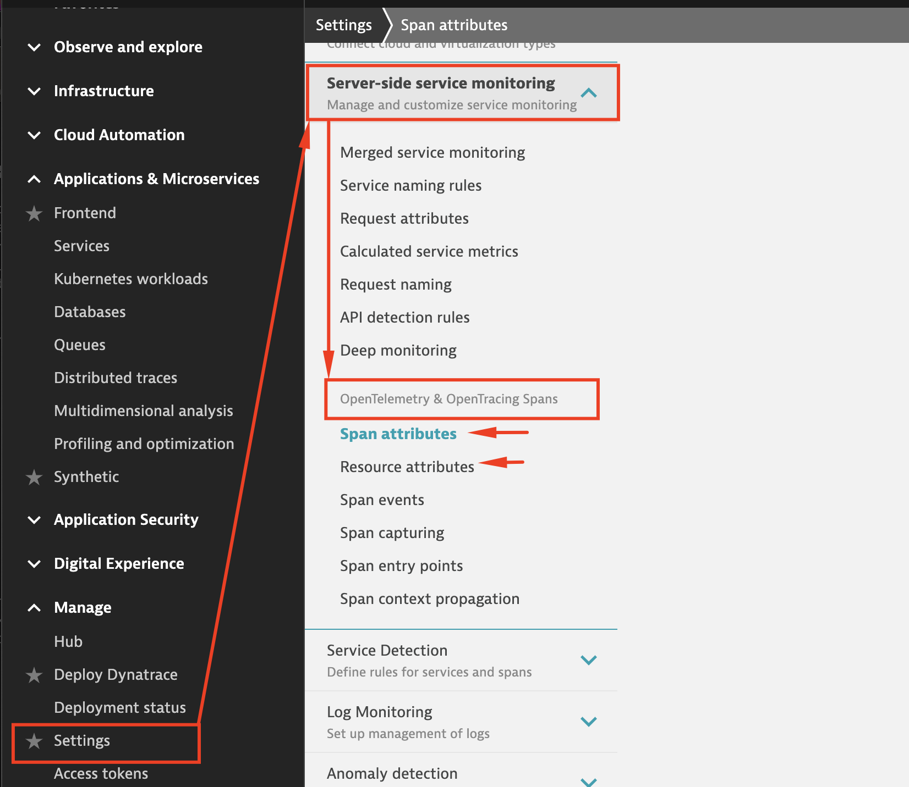

1. Add the relevant keys from your span & resource  attributes which you want Dynatrace to capture:

    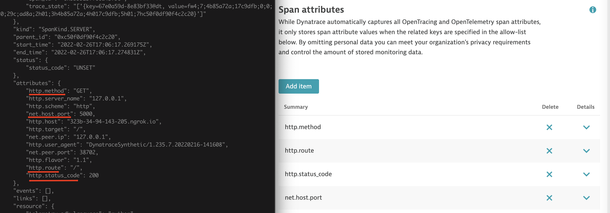

    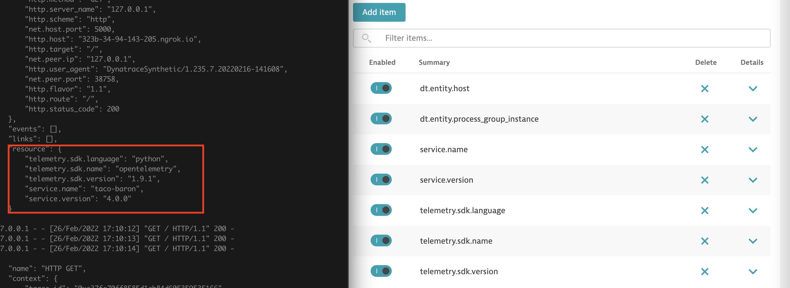

1.  These attributes will then be stored in Dynatrace on all subsequent spans sent to Dynatrace:

    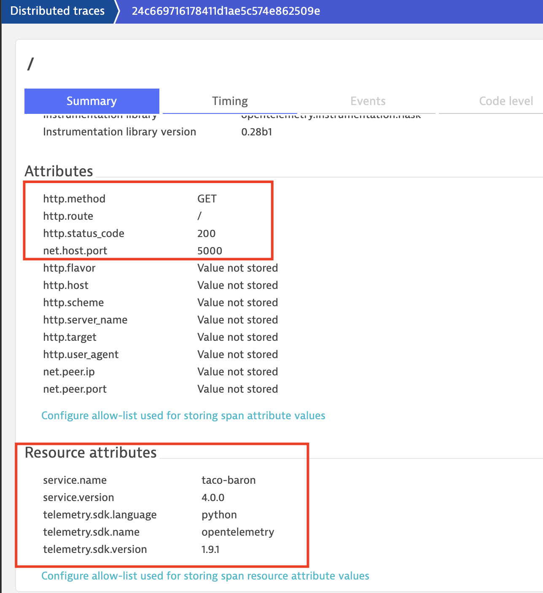